
# Pocket Health Advisor
This repositories is Android app for Pocket Health Advisor

## Related Repositories
- [Web View Hospital](https://github.com/wanching0730/angular-hospital-2)
- [Web View Doctor](https://github.com/wanching0730/Doctor-View-Angular)
- [Cloud Function](https://github.com/WLun001/infermedica-cloud-function)
- [Braintree Server](https://github.com/WLun001/braintree-server)

# Project Overview
## Abstract
- Hectic life and pack scheduling of people​ .
- Less concern about health issue​. ​
- Giving up on treatment due to long queue​.

## Problem statement
- Long waiting time for patients in Malaysia hospital.
- People not aware about their existing health issues​.

## Objectives
- To develop an mobile application to get on demand healthcare advises from users' syndromes​.​
- To develop an mobile application that is able to consult doctor at any place via video calling .
​- To develop an mobile application to reduce the waiting time for patients.
- To develop a web application for hospitals to manage patients' appointments.​
- To develop a web application for doctors to interact with patients via video calling and read patients' medical report​.

## Feature List
### User Mobile View
- Check personal health condition with Chatbot and view the report generated
- Look for nearby hospitals
- Look for registered hospitals and request for appointment
- View personal appointments
- Make payment before consultation
- Make video call with doctor (during appointment)

### Hospital Web View
- Create doctors, appointments
- View doctors, patients, appointments
- Update doctors, patients, appointments
- Delete doctors, patients, appointments
- Manage patient waiting list

### Doctor Web View
- View list of appointments
- Make video call with patients
- View patient’s medical report (generated by system after interview by Chatbot)

## Application Flow
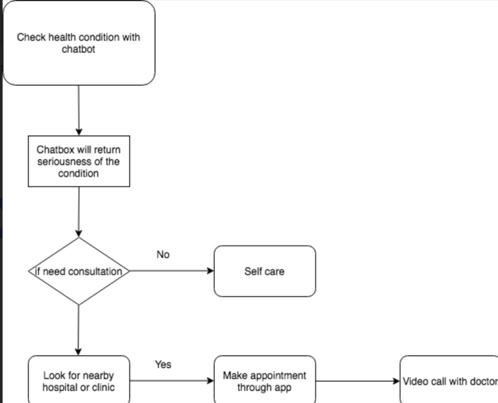

## Architecture Design
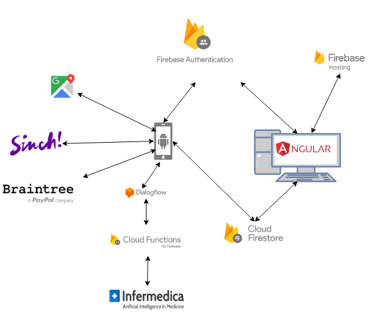

## UI Screenshot
Login           |  Main      |  Chatbot
:---------------------------:|:---------------------------:|:---------------------------:
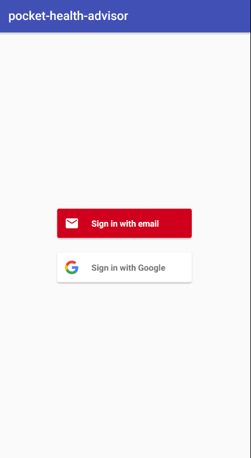 |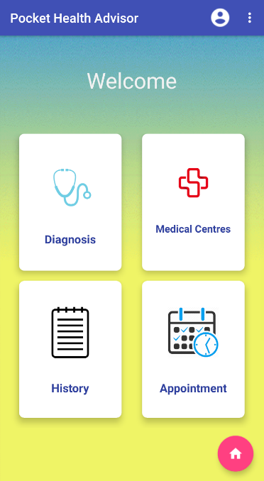 | 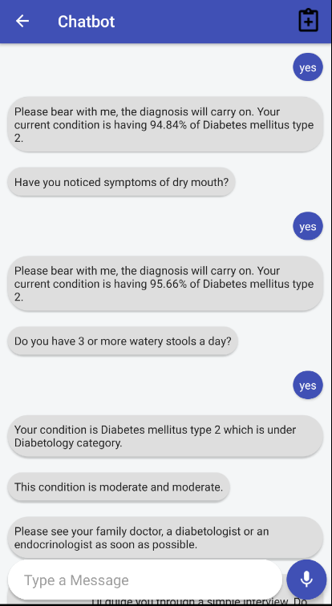
 Generated Report | Full Medical Report | Nearby Hospitals
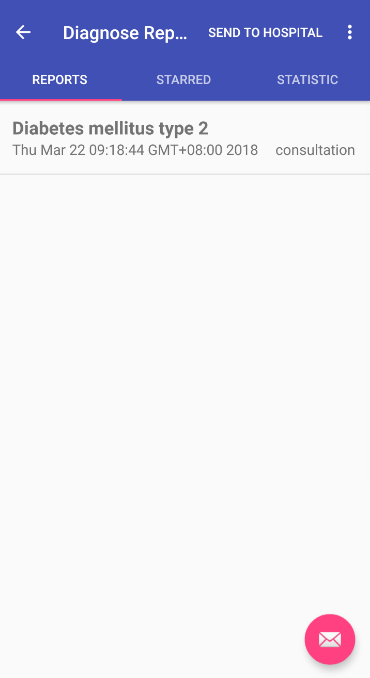 |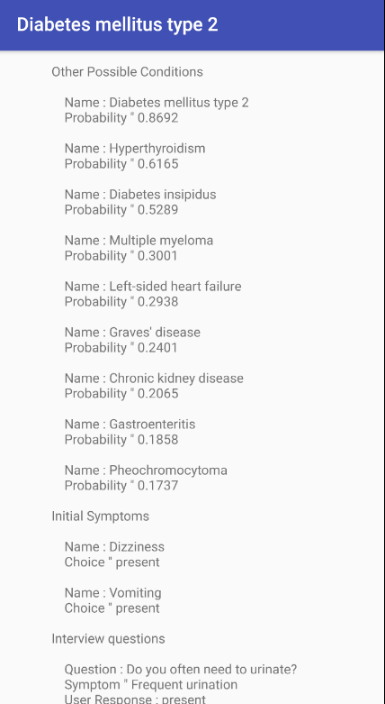 |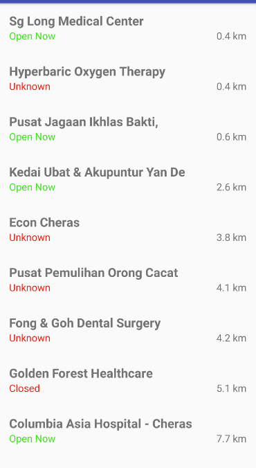
| Registered Hospitals      |Request Appointment | Appointment
 | 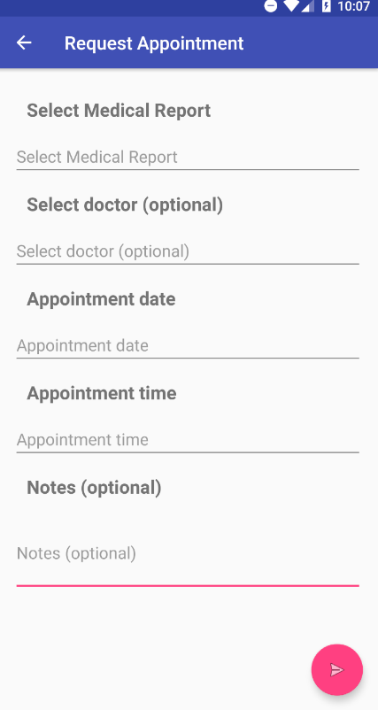 | 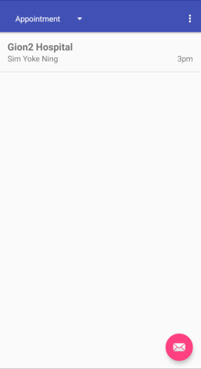
 Video Call | In-app payment
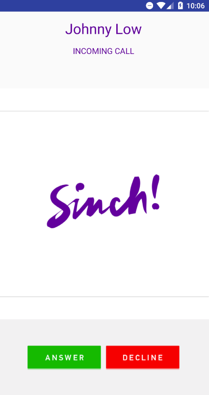 | 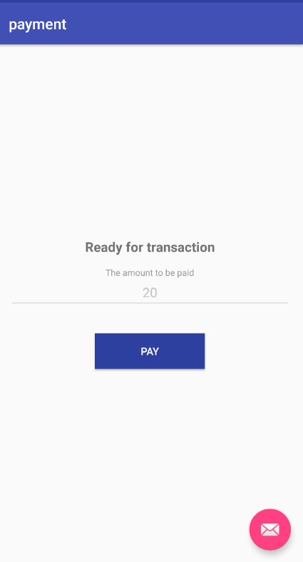

## Technologies Used
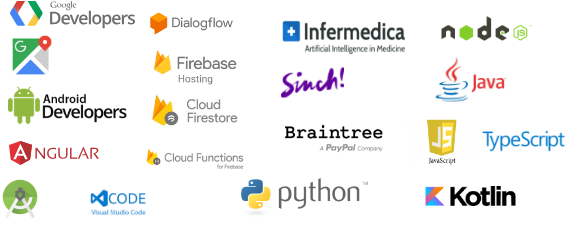
   * **Services**
     * [DialogFlow](https://dialogflow.com)
     * [Firebase Authentication](https://firebase.google.com/docs/auth)
     * [Firebase Cloud Firestore](https://firebase.google.com/docs/firestore)
     * [Firebase Cloud Functions](https://firebase.google.com/docs/functions)
   * **APIs**
     * [Braintree Payment](https://www.braintreepayments.com)
     * [Google Maps API](https://developers.google.com/maps)
     * [Infermedica](http://infermedica.com) (Source of medical content)
     * [Sinch](https://www.sinch.com)
   * **Frameworks**
     * [Android](https://developer.android.com/index.html)
     * [Angular](https://angular.io)
     * [Flask](http://flask.pocoo.org)
   * **Languages**
     * [Java](https://java.com)
     * [JavaScript](https://www.javascript.com)
     * [Kotlin](https://kotlinlang.org)
     * [Python](https://www.python.org)
     * [TypeScript](https://www.typescriptlang.org)
   * **IDE**
     * [Android Studio](https://developer.android.com/studio)
     * [Sublime Text](https://www.sublimetext.com) 
     * [Visual Studio Code](https://code.visualstudio.com)
   * **Other**
     * [NodeJs](https://nodejs.org/en)
